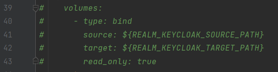

# Spring Boot Keycloak Project

Тестовый проект для работы с SSO Keycloak

## Параметры конфигурации application.yml

`auth-server-url: https://<keycloak host>/auth` - путь до сервиса KeyCloak;  
`realm:` - имя проекта, для которого создано пользовательское пространство в KeyCloak;
`resource:` - имя приложения, оно же client_id в KeyCloak;  
`credentials.secret:` - секрет конкретного клиента, который должен быть известен приложению.  
  
Чтобы импортировать realm:  
1) Добавьте файл `realm-export.json` по пути `./src/main/resources/import` и добавьте полный путь к json файлу в переменную `REALM_KEYCLOAK_SOURCE_PATH` в файле `.env.keycloak`  
2) Раскомментируйте строки в `docker-compose.yml` файле  
  

## Параметры заголовка

`grant_type` – тип запроса на получение токена. Мы будем использовать тип «password» для запроса при авторизации
пользователя и тип «refresh_token» для запроса обновления токена.  
`client_id` – имя приложения зарегистрированного в KeyCloak. Он же параметр keycloak.resource конфигурации KeyCloak
Adapter описанный ранее.  
`username/password` – credentials доменной учетки, будут использоваться в запросе получения токена.  
`refresh_token` – собственно refresh_token, будет использоваться в запросе обновления токена.  
И в методе аутентификации и refresh токена используем одну и ту же ссылку для обращения к KeyCloak.

## Тестирование API (curl запросы)

1) Аутентификация (получение токенов)  
```   
curl --location --request POST 'http://localhost:8282/realms/<your_realm>/protocol/openid-connect/token' \
   --header 'Content-Type: application/x-www-form-urlencoded' \
   --data-urlencode 'client_id=<your_client_id>' \
   --data-urlencode 'client_secret=<your_client_secret>' \
   --data-urlencode 'username=<user login>' \
   --data-urlencode 'password=<user password>' \
   --data-urlencode 'grant_type=password'
```
2) Refresh токенов  
```   
curl --location --request POST 'http://localhost:8282/realms/<your_realm>/protocol/openid-connect/token' \
   --header 'Content-Type: application/x-www-form-urlencoded' \
   --data-urlencode 'client_id=<your_client_id>' \
   --data-urlencode 'client_secret=<your_client_secret>' \
   --data-urlencode 'refresh_token=<your refresh token>' \
   --data-urlencode 'grant_type=refresh_token'
```
3) Получение информации о пользователе  
```   
curl --location --request POST 'http://localhost:8282/realms/<your_realm>/protocol/openid-connect/userinfo' \
   --header 'Authorization: bearer <your access token>' 
```